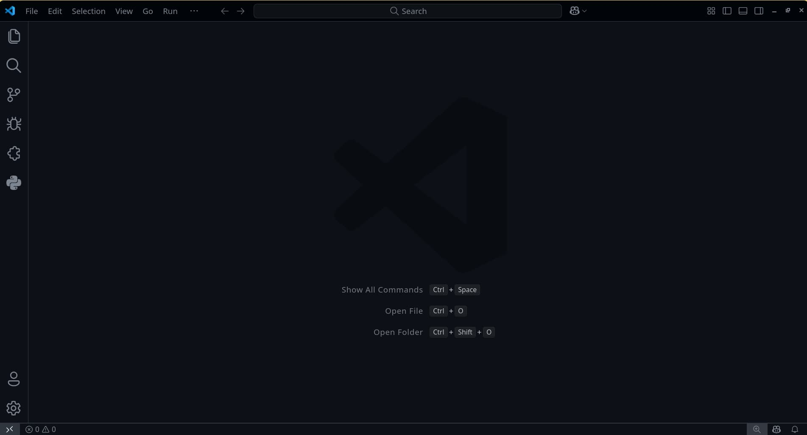

# First Hello world Program

## 1. Open `VS Code` editor.
   
## 2. Create/Open a folder to work in
From the top-menu-bar choose `file>Open Folder` then choose any folder where you want your project/code to be. (e.g. my_learning_proj)
-  you can make new folder if there is non or use already existing folder. (use empty folder)
	
- Now you can save the workspace shortcut in your desktop to open this folder automatically when double clicked. 
	- `file>save_workspace_as...`
## 3. Create a C++ file 
Now create a new file named `main.cpp`    --> ( file name can be anything but the extension must be `.cpp` for C++ code to work with compiler )
## 4. Write this `quick` C++ code
Now, write/type the following code in that file
main.cpp :
```cpp
#include <iostream>
using namespace std;

int main()
{
	cout << "Hello, world";
	return 0;
}
```
- for explaination view : [this page](explain.md)
- Reference Image :


## 5. Make a script for compilation and running
Make another file named `run.bat` if you are in windows. 
	- in Linux you have to make "run.sh"
## 6. Write this `quick` script code
now write/type the following code into it.
run.bat :
```Batch
g++ main.cpp -o main.exe
main.exe
```
- 
## 7. Now save both files (if not saved automatically)
## 8. Open Integrated terminal
- Open an Integrated Terminal inside the VSCode in the location where you open your Project. just right click on the blank spot of the file explorer at the left and choose `Open in Integrated Terminal`
- 
### 8.2. Run the Script ( it will show the answer )
in the integrated terminal, just run the "run.bat" script you just made.
	- If the trminal is powershell/bash then type
```powershell
./run.bat
```
	- If the trminal is CMD then type

```CMD
run.bat
```
and click `enter` key when you cursor is focused on the turminal (not in other section like file explorer)
- 