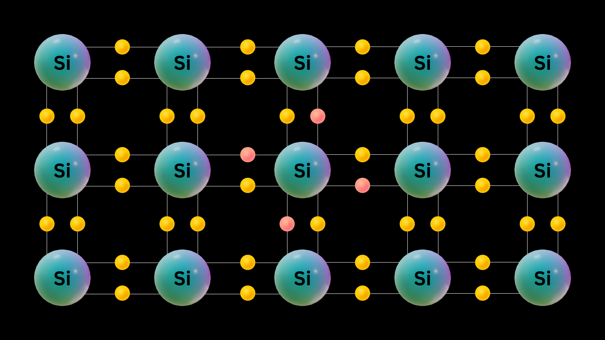
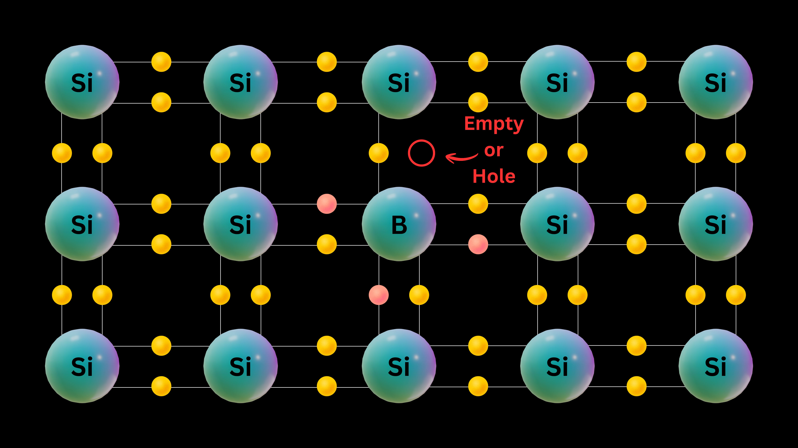
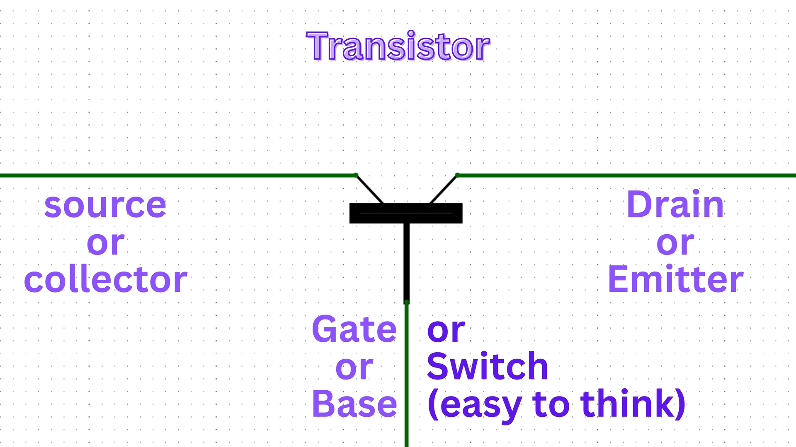
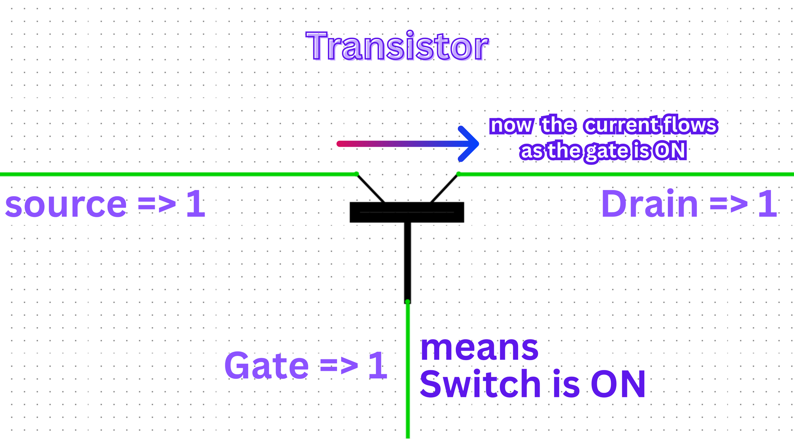
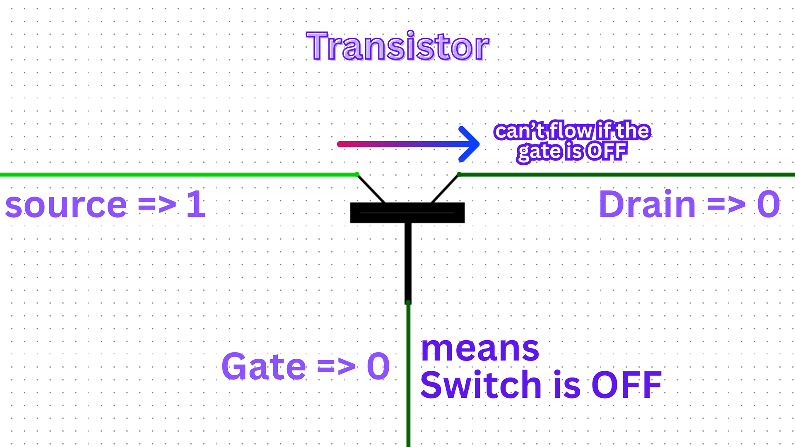

# Transistor

## Definition

A **transistor** is a small semi-conductor that controls the flow of electricity in a circuit.

`It can let electricity pass, block it, or change how much flows, depending on the signals it receives.`

## What is a semi-conductor?

A **semiconductor** is a material that can sometimes **conduct electricity** and sometimes **block** it.

### Silicon:

  
  

`It does not let electricity flow as easily as a metal, but it is not as resistant as an insulator.`

###### Example: **[Silicon](https://periodic-table.rsc.org/element/14/silicon)** is the most common semiconductor material used.
<!-- silicon bond image -->

## Conductivity Boosting

To increase the conductivity of semiconductors (like silicon), small amounts of other atoms are added. This process is called **doping**.

###### Result: the conductivity of semi-conductor increases.

Depending on the type of atom added, the semiconductor becomes either:

1. **n-type**: Doped with atoms that have extra electrons (such as phosphorus). These extra electrons are free to move, making the material better at conducting electricity.
2. **p-type**: Doped with atoms that have fewer electrons (such as boron). This creates "holes" (spaces where an electron could go), and these holes help carry electricity through the material.

## n-type

In n-type semiconductors, the added atoms provide extra electrons, which are the main charge carriers.

## p-type

In p-type semiconductors, the added atoms create holes, and these holes act as the main charge carriers.

### What actually lets the electricity flow?

In a semiconductor, electricity is carried by two things:
- **Electrons** (negatively charged particles)
- **Holes** (empty spaces where an electron could be, acting like positive charges)

In **n-type** material, electrons are the main carriers.  
In **p-type** material, holes are the main carriers.

When a voltage is applied, electrons move towards the positive side, and holes move towards the negative side, allowing current to flow through the material.

---

## Structure
What happens when we put one type of semiconductor between two others of the same type? (e.g. n-p-n or p-n-p)

If you arrange the layers as n-p-n or p-n-p, you create a structure where the middle layer is different from the outer layers.  

- In **p-n-p**, a thin n-type layer is sandwiched between two p-type layers.
- In **n-p-n**, a thin p-type layer is sandwiched between two n-type layers.

##### Example Image:

## Flow
There is an electrical contact at both outer layer for electricity to flow between them.

This arrangement forms the basic structure of a **transistor**. The middle layer (called the **base**) controls whether electricity can flow between the outer layers (called the **emitter** and **collector**).

`electricity is meant to flow between 'source' and 'drain'.`

## Gate
Instead of an mechanical switch there is a third electrical Contact called gate.
- this gate is insulated from the semiconductor by an '**Oxide Layer**'.

##### In this image:
- Blue color -> Gate [ the electrical contact that works the gate ]
- Gray color -> Oxide insulator layer

## Depletion Layer:

when these are layed as shown in the pattern, they don't stay as they were. 

The excess electrons from n-type semi-conductors moves toward the excess holes of p-type creating a depletion layer.

`This depletion layer block the flow of electricity between **'source'** and **'drain'**`

- excess electron in n-type: which behave as a carrier of electricity in n-type
- excess holes in p-type: which behave as a carrier of electricity in p-type

---
###### **Dear curious readers, you may wonder: we made the material conductive by doping, but now we are making a pattern to stop or control the flow. Read further to know why!**
---

## Twist: Making the Layers Togglable for Electricity Conduction

The special thing about this layered structure is that the middle layer acts like a gate or switch.  
- By applying a small voltage or current to the base (middle layer), the **'Depletion Layer'** is shrinked by taking out the filled holes. this creates a pathway through pnp or npn layers.
`in this example n-p-n`

This is the key principle behind how transistors work:  
**A small signal at the base can control a large flow of electricity between the emitter and collector.**

---

`This is how transistors are made`

---

## Components
Transistors typically have three terminals:
- **Emitter** (or Source for FETs)
- **Base** (or Gate for FETs)
- **Collector** (or Drain for FETs)

Note : electricity can flow between source and drain if the base/gate is ON. 

Transistors can function as:
- Amplifiers (increasing signal strength)
- **Switches** (turning current on/off)

Their invention revolutionized electronics, enabling the development of smaller, faster, and more reliable devices.

---

## Transistor as a Switch

The most fundamental use of a transistor in digital electronics is as an incredibly fast electronic switch. This on/off capability is the basis for the binary code (0s and 1s) that computers use.

  
  

### The "OFF" State (Logical 0)
When there is no voltage applied to the **Gate**, the depletion layer between the **Source** and **Drain** remains intact, as we saw earlier. This layer acts as a barrier, preventing any current from flowing. The switch is considered **OFF**.

- **Input:** 0V at the Gate
- **Result:** No current flows
- **Represents:** A logical **0**

### The "ON" State (Logical 1)
When a positive voltage is applied to the **Gate**, its electric field creates a conductive channel between the **Source** and **Drain**, overcoming the depletion layer. This allows current to flow freely. The switch is now **ON**.

- **Input:** Positive voltage at the Gate
- **Result:** Current flows
- **Represents:** A logical **1**

By rapidly turning this switch on and off, we can create the digital signals that power all modern computing. Combining these simple switches allows us to build logic gates, which are the next step in our journey!
